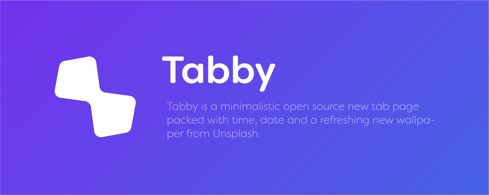
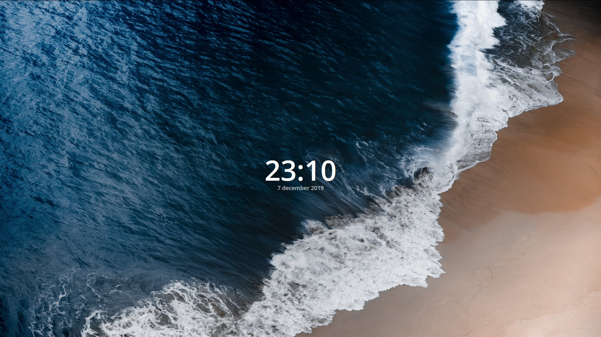
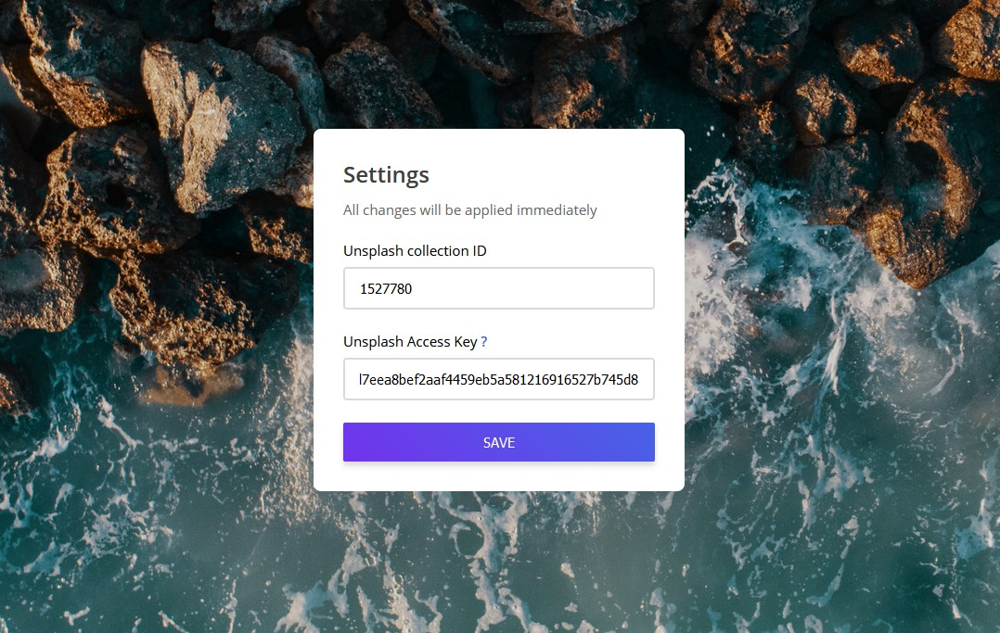

   

## Showcase
<table>
  <tbody>
    <tr>
      <td align="center" valign="middle">
        
      </td>
      <td align="center" valign="middle">
        
      </td>
    </tr>
  </tbody>
</table>

## How to use?
Just download this repository, save it on a secure place and add it to your extensions using the "unpack extension" option. It will be added to the Chrome Web Store in the near future.

In order to get wallpapers, you need register as a developer on [Unsplash Developer Portal](https://unsplash.com/developers).

## Features
* Beautiful wallpaper from Unsplash every minute
* See the current time
* See the current date

## Stores
#### Download on [Google Chrome Webstore](https://chrome.google.com/webstore/detail/tabby/jkamfiammgahipdnjjdphkjblmlpjdch)
#### Download on[Firefox Add-Ons](https://addons.mozilla.org/en-US/firefox/addon/tabby-tab/)

## License
[MIT](LICENSE)

## Keywords
tab,tab home,new tab,unsplash,clock,time,wallpaper

## Changelog

#### V1.1
* Added support for Firefox
* Added new logo
* Minor cleanup

#### V1.0
* Start of the extension